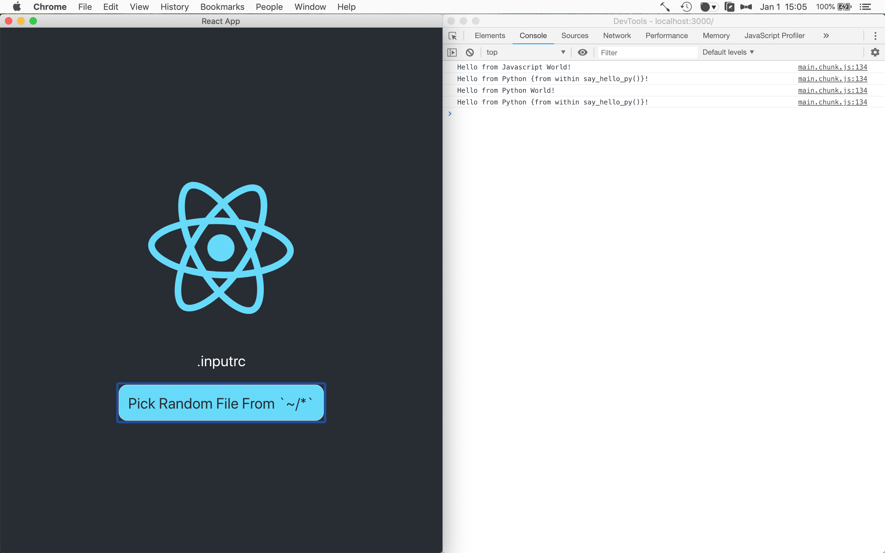

> "Eello World example": Create-React-App (CRA) and Eel

**Table of Contents**

<!-- TOC -->

- [07 - CreateReactApp Documentation](#07---createreactapp-documentation)
    - [Quick Start](#quick-start)
    - [About](#about)
    - [Main Files](#main-files)

<!-- /TOC -->

# 07 - CreateReactApp Documentation

Eello World example Create-React-App (CRA) with Eel. This particular project was bootstrapped with `npx create-react-app 07_CreateReactApp --typescript` (Typescript enabled), but the below modifications can be implemented in any CRA configuration or CRA version.

If you run into any issues with this example, open a [new issue](https://github.com/ChrisKnott/Eel/issues/new) and tag @KyleKing

## Quick Start

1. **Configure:** In the app's directory, run `npm install` and `pip install bottle bottle-websocket future pyinstaller`
2. **Demo:** Build static files with `npm run build` then run the application with `python eel_CRA.py`. A Chrome-app window should open running the built code from `build/`
3. **Distribute:** (Run `npm run build` first) Build a binary distribution with PyInstaller using `python -m eel eel_CRA.py build --onefile` (See more detailed PyInstaller instructions at bottom of [the main README](https://github.com/ChrisKnott/Eel))
4. **Develop:** Open two prompts. In one, run  `python eel_CRA.py true` and the other, `npm start`. A browser window should open in your default web browser at: [http://localhost:3000/](http://localhost:3000/). As you make changes to the JavaScript in `src/` the browser will reload. Any changes to `eel_CRA.py` will require a restart to take effect. You may need to refresh the browser window if it gets out of sync with eel.



## About

> Use `window.eel.expose(func, 'func')` to circumvent `npm run build` code mangling

`npm run build` will rename variables and functions to minimize file size renaming `eel.expose(funcName)` to something like `D.expose(J)`. The renaming breaks Eel's static JS-code analyzer, which uses a regular expression to look for `eel.expose(*)`. To fix this issue, in your JS code, convert all `eel.expose(funcName)` to `window.eel(funcName, 'funcName')`. This workaround guarantees that 'funcName' will be available to call from Python.

## Main Files

Critical files for this demo

- `src/App.tsx`: Modified to demonstrate exposing a function from JavaScript and how to use callbacks from Python to update React GUI
- `eel_CRA.py`: Basic `eel` file
  - If run without arguments, the `eel` script will load `index.html` from the build/ directory (which is ideal for building with PyInstaller/distribution)
  - If any 2nd argument (i.e. `true`) is provided, the app enables a "development" mode and attempts to connect to the React server on port 3000
- `public/index.html`: Added location of `eel.js` file based on options set in eel_CRA.py

  ```html
  <!-- Load eel.js from the port specified in the eel.start options -->
  <script type="text/javascript" src="http://localhost:8080/eel.js"></script>
  ```

- `src/react-app-env.d.ts`: This file declares window.eel as a valid type for tslint. Note: capitalization of `window`
- `src/App.css`: Added some basic button styling
