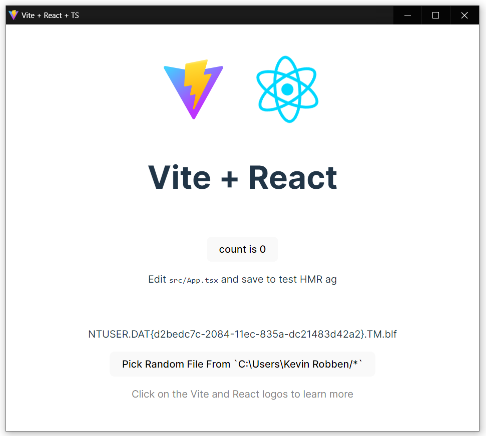

> "Eello World example": Vite, React, Typescript and Eel

**Table of Contents**

<!-- TOC -->

- [11 - CreateReactApp Documentation](#07---createreactapp-documentation)
    - [Features](#features)
    - [Quick Start](#quick-start)
    - [About](#about)
    - [Main Files](#main-files)

<!-- /TOC -->

# 11 - ViteReact-TS Documentation

Eello World example Vite React Typescript with Eel. This example is a newer version of example [07 - CreateReactApp](https://github.com/python-eel/Eel/tree/main/examples/07%20-%20CreateReactApp) by @KyleKing. This particular project was bootstrapped with `npm create vite@latest ViteReactTS --template react-ts` (Typescript enabled) and `Python 3.11`.

## Features

- **Multiple instances** To enable multiple instances of this application in production (i.e. the user opens the application multiple times), a new free socket port is searched for on app startup and injected in to `./dist_vite/index.html` and `./dist_vite/assets/index.*.js` before eel.init().
- **Splashscreen** A default splash-screen is provided so the user had direct feedback when the .exe file opened

## Quick Start

1. **Configure:** In the app's directory, run `npm install` and `pip install virtualenv`
2. **Virtual envirioment** Create a new virtual envirioment using `python -m venv env`. Open a new powershell window in the project directory and run `Set-ExecutionPolicy -ExecutionPolicy RemoteSigned -Scope CurrentUser` to enable running venv activate script. Then activate the virtual envirioment with venv using `.\env\Scripts\activate.ps1`. Now using this virtual env run `pip install -r requirements.txt` See the footnote about Bottle.py!
3. **Demo:** Build static files with `npm run build` then run the application with `python main.py` from the venv powershell window. A Chrome-app window should open running the built code from `dist_vite/`
4. **Distribute:** (Run `npm run build` first) Build a binary distribution with PyInstaller using `python -m eel main.py dist_vite --onedir --splash splashfile.png --path env/lib/site-packages --noconsole` from the venv powershell window (See more detailed PyInstaller instructions at bottom of [the main README](https://github.com/ChrisKnott/Eel)). The .exe will be generated in `.\dist\main\main.exe`. Try to open two instances of the application, you will find that it just works :)
5. **Develop:** Open two prompts. In one, run  `python main.py true` and the other, `npm run dev`. A browser window should open in your default web browser at: [http://localhost:5173/](http://localhost:5173/). As you make changes to the JavaScript in `src/` the browser will reload. Any changes to `main.py` will require a restart to take effect. You may need to refresh the browser window if it gets out of sync with eel.

**Note** # Bottle has a issue with stdout when using pyinstaller --noconsole. The latest developent version of bottle `0.13-dev` (not available on pypi) has a fix for this issue. In env/site-packages replace Bottle.py with  bottle=`0.13-dev`: [https://github.com/bottlepy/bottle/blob/master/bottle.py](https://github.com/bottlepy/bottle/blob/master/bottle.py)



## About

> Use `window.eel.expose(func, 'func')` to circumvent `npm run build` code mangling

`npm run build` will rename variables and functions to minimize file size renaming `eel.expose(funcName)` to something like `D.expose(J)`. The renaming breaks Eel's static JS-code analyzer, which uses a regular expression to look for `eel.expose(*)`. To fix this issue, in your JS code, convert all `eel.expose(funcName)` to `window.eel(funcName, 'funcName')`. This workaround guarantees that 'funcName' will be available to call from Python.

## Main Files

Critical files for this demo

- `web_src/App.tsx`: Modified to demonstrate exposing a function from JavaScript and how to use callbacks from Python to update React GUI
- `main.py`: Basic `eel` file
  - If run without arguments, the `eel` script will load `index.html` from the dist_vite/ directory (which is ideal for building with PyInstaller/distribution)
  - If any 2nd argument (i.e. `true`) is provided, the app enables a "development" mode and attempts to connect to the React server on port 5173
- `web_src/index.html`: Added location of `eel.js` file based on options set in main.py

  ```html
  <!-- Load eel.js from the port specified in the eel.start options -->
  <script type="text/javascript" src="http://localhost:5169/eel.js"></script>
  ```
  
